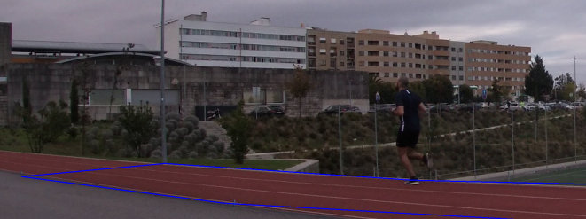

# Can I run 30 km/h?

A while back I had a discussion with some of my colleagues. The topic was running speed, particularly the top speed I could potentially achieve in a given game of football. I was under the impression that some of my runs must be around the 30 km mark but the consensus on the table was that that figure is far too high.

Granted I'm far from an athlete. But my belief is that 30 km/h is not unachievable, particularly if we're talking about peak speed during a particular run.

**My Goal**: use object detection, along with a mapping function, to calculate my speed during a run. It's a long but relatively simple task, for which we'll only really need `opencv`, `tensorflow` and maybe the wind on our side to pull it off.

## Steps of This Project:
0. Record a run, hopefully of 30 km/h;
1. **Detection** - Using object detection, create a bounding box in each frame of the video detecting where I am; 
2. **Tracking** - Smooth the Detections by using tracking. In other words, associate an id to each of the bounding boxes found in the picture, and keep track of their movements while maintaining the id for the objects that were already found in the past. In this document we'll use `deep sort`;
3. **Mapping** - Map the detections to a 2D area using landmarks on the video. In this particular case I know the dimensions of the ground I am running over, thus i merely need to map my position on the screen (pixel) to a 2D map of the ground;
4. **Speed Calculation** - Calculating speed is trivial given the output of the previous step. Distance over time;
5. Brag to your friends or hide in shame;

## Detection & Tracking

Our first goal is to detect my position on the run at each of the frames of the video feed. For this we have multiple options but, since what we would like to track is fairly common (person) we can use a tensorflow model, pre-trained on the **COCO dataset**, in which one of the labels is *person*.

In this document we will use a YoloV4 model, generating the labels and saving them to into a file the will later be used for tracking.

For this, I will run the script "run detection". The output will be all of the frames of my run, along with the bounding boxes of every person in the video. 

### 2D surface Area

One of our main inputs is the surface position, in pixels, within the frames of the video. We have a stable camera angle, meaning that the position of the area of interest will remain the same throughout the video. We can confirm our coordinates easily by checking the first frame of the video with a drawing of the surface area.


```python
import numpy as np
import time
import cv2
import matplotlib.pyplot as plt
import pickle
```


```python
vid = cv2.VideoCapture('./data/video/speed_detect.mp4')
```


```python
def rescaleFrame(frame, scale = 0.75):
    width = int(frame.shape[1] * scale)
    height = int(frame.shape[0] * scale)
    dimensions = (width, height)
    
    return cv2.resize(frame, dimensions, interpolation = cv2.INTER_AREA)
```


```python
def check_area_of_interest(video_name, area_of_interest):
    
    vid = cv2.VideoCapture(f'./data/video/{video_name}')
    pts = np.array(area_of_interest, np.int32)
    pts = pts.reshape((-1, 1, 2))
    
    isClosed = True
    color = (255, 0, 0)
    thickness = 2
    
    while True:
        isTrue, frame = vid.read()
        frame = cv2.polylines(frame, [pts], 
                          isClosed, color, thickness)
        frame = rescaleFrame(frame, 0.40)

        font_scale = 1
        font = cv2.FONT_HERSHEY_PLAIN
        cv2.imshow('Video', frame)
        
        if cv2.waitKey(20) & 0xFF == ord('q'):
            break

    vid.release()
    cv2.destroyAllWindows()
```


```python
check_area_of_interest('speed_detect.mp4'
                       , [[275, 1275],[845, 1350],[3900, 1520],[3560, 1335],[1375, 1285], [680, 1238]])
```

After multiple iterations we get a surface area that looks as follows:




After that we're ready to proceed with the detection phase.

### Running the Detection Script

After we are happy about the area of interest, we can finally run the detection / tracking script, while keeping record of every object of interest. 
Note that we could choose to run everything in the same script, but in this demostration I chose to separate tracking and speed detection tasks, since that's the main point of our document.


```python
with open('track_my_run.pickle', 'rb') as f:
    run = pickle.load(f)
```

The file run has a dictionary with the position of my run, for every frame of the video with the following format:


```python
run[300]
```


    {'1': ('person', (1947, 949, 2154, 1346))}


Meaning that for frame 300 person 1 was on the frame and was on the position (1947, 949, 2154, 1346).

## Mapping

The video we shot was taken from a fixed angle. However, the value of a pixel movement is different for each frame on the video. When further away from the camera, a pixel movement might mean a lot but when closer to the camera 1 pixel is very little. We will use the mapping detailed in the section above, to get out position relative to the ground we are running over, of which we know the dimensions. 


The picture above ilustrates what we are trying to do. In the video there is a surface, of which I know the dimensions of. We need to map the pixel position of our run (i.e. the central point of the bottom part of the detection box, which is right beneath my feet) and map it to a 2D surface, as detailed, quite crudely but effectively, above in yellow. 


```python
def order_points(points, is_horizontal):
    """
    This function accepts a list of points and ranks them, from first to last
    in either the horizontal order or vertical order.
    Points is either a (n,2) matrix or a (2,n) matrix, depending on the 
    orientation of the polygon.
    """
    for point in points:
        if not len(point) == 2:
            raise ValueError('Please Include Points with 2 dimensions!')
        
        if not len(points) % 2 == 0:
            raise ValueError('Please include an even number of points')
            
        if is_horizontal:
            c = 0
        else:
            c = 1
            
            
        index = []
        measure_value = np.array([x[c] for x in points])
        order = measure_value.argsort()
        ranks = order.argsort()
        return ranks
```


```python
def get_position(value, array):
    position = np.argmax(array == value)
    return position
```


```python
def get_array(points, ranks, current_last):
    """
    Get the next array of points that makes up the next four sided polygon to
    add to the list of polygons that constitute the area_of_interest
    """
    
    chosen_index = []
    chosen_points = []
    output_points = []
    output_index = []
    
    if current_last:
        start_n = current_last - 1
        end_n = current_last + 2
    else:
        start_n = 0
        end_n = 3
        
    for i in range(start_n, end_n + 1):
        current_last = i
        point = get_position(current_last, ranks)
        chosen_points.append(points[point])
        chosen_index.append(point)
    
    # reorder info to keep format of the polygon
    
    while chosen_index:
        index = min(chosen_index)
        chosen_index.remove(index)
        output_points.append(points[index])
        output_index.append(index)
        
    return output_points, output_index, current_last
```


```python
def create_arrays(points, is_horizontal):
    """
    From a list of points get an array of 4 sided polygons, that are disjoint
    and of which the union makes the main figure.
    """
    ranks = order_points(points, is_horizontal)
    arrays = []
    indexes = []
    
    current_last = None
    
    while current_last != max(ranks):
        array, index, current_last = get_array(points, ranks, current_last)
        #print(current_last)
        arrays.append(array)
        indexes.append(index)
        
    return arrays, indexes
```


```python
def get_real_arrays(real_dim_array, indexes):
    """
    Get the real dimensions based on an array of indexes.
    """
    real_arrays = []
    for index in indexes:
        real_array = []
        for point in index:
            real_array.append(real_dim_array[point])
        real_arrays.append(real_array)
    return real_arrays
```

All of these functions are going to be useful for our PixelMapper class, detailed below.


```python
from shapely.geometry import Point
from shapely.geometry.polygon import Polygon


class PixelMapper(object):
    """
    A class that takes in a group of points that constitute the area of interest of 
    the video, and mapps it to a 2D surface area with real dimensions. 
    """
    
    def __init__(self, pixel_array, real_dim_array, is_horizontal):
        
        self.arrays, self.indexes =  create_arrays(pixel_array, is_horizontal)
        self.real_arrays = get_real_arrays(real_dim_array, self.indexes)
        
        count = 0
        self.TransformMatrices = {}
        for array in self.arrays:
            self.TransformMatrices[count] = {}
            self.TransformMatrices[count]['M'] = cv2.getPerspectiveTransform(np.float32(self.arrays[count])
                                                                             ,np.float32(self.real_arrays[count]))
            self.TransformMatrices[count]['invM'] = cv2.getPerspectiveTransform(np.float32(self.real_arrays[count])
                                                                                ,np.float32(self.arrays[count]))
            count += 1
    
    
    def is_pixel_of_interest(self, pixel):
        count = 0
        for array in self.arrays:
            point = Point(pixel)
            polygon = Polygon(array)
            if polygon.contains(point):
                return True, count
            count += 1
        return False, None
    
    
    def pixel_to_real_dim(self, pixel):
        """
        Using the pixel position the function returns the position in the 2D map
        returning False if the position is not above the area of interest.
        """
        
        
        is_in_area, target_array = self.is_pixel_of_interest(pixel)

        if is_in_area:
            
            if type(pixel) != np.ndarray:
                pixel = np.array(pixel).reshape(1,2)
            pixel = np.concatenate([pixel, np.ones((pixel.shape[0],1))], axis=1)
            real_dim = np.dot(self.TransformMatrices[target_array]['M'],pixel.T)

            return (real_dim[:2,:]/real_dim[2,:]).T, True
        else:
            return None, False
    

```

From here we simply have to create the object of our map.


```python
my_map = PixelMapper([[275, 1275],[845, 1350],[3900, 1520],[3560, 1335],[1375, 1285], [680, 1238]]
                     ,[[0, 12],[30, 12],[66, 12],[66, 0],[30, 0], [0, 0]]
                     ,True)
```

Note that the "Real dims are 12 by 66". This is the number of feet it took me to cover the whole area. This measure is not particularly accurate, and it is prone to error but, it will still be ok for a ballpark figure. 


```python
my_map.pixel_to_real_dim([285, 1275])
```


    (array([[ 0.33684526, 11.84085911]]), True)


The interpretation of the code above is that the pixel `[285, 1275]` is part of the area of interest, and it's positioned on the step 0.33 out of 66 and the height 11.84 out of 12. This makes sense since this pixel is close to one of the corners of our area of interest.
After getting a pixel tracking for each frame, and a mapping to a 2D area, we're ready to finally calculate **speed**.

## Speed Calculation

Speed calculation is straightforward from the output of the last section. There are still some things that we should consider:
* While we should use both dimensions in a normal setting, in this particular case we are going to ignore the width (y) because we are running at a straight line. Any variation in the width is probably a mapping error;
* Our measurements are in feet. We'll have to translate them to km in order to get the final result;
* From one pixel to the next the position is quite erratic. However, if we compare pixels that are multiple frames apart, the velocity becomes more stable and less noisy. In this exercise we'll use a window of 30 frames;


```python
def get_target_point(box):
    y = box[-1]
    x = (box[0] + box[2])/2
    return [x,y]
```


```python
get_target_point(run[300]['1'][1])
```


    [2050.5, 1346]


This means that the box of person 1 on frame 300 can be seen as a single-pixel point, namely `[2050.5, 1346]`. Person 1 was not our best iteration. By watching the whole video I was particularly interested in the speed of "person_15", which was one of my best runs. 


```python
# get points from person 15
# person 15 is one in which I feel I ran particularly quickly 
# (relative to the other tries)
my_target_run = []
for i in range(1,7157):
    if run[i].get('15','NA') != 'NA':
        my_target_run.append(i)
```

After selecting my run I merely need to estimate my velocity in each frame.


```python
def from_feet_to_km(feet_per_hour, conv = 32):
    """
    Function that converts feet to km, where conv is the measurement in cm of the foot
    Note that foot is my foot, not the american measure of distance.
    """
    return feet_per_hour * conv * 10**(-5)
```


```python
target_position = []
target_speed = []
my_target_points = []
avg_speed = []
count = 0
for i in my_target_run:
    my_target_point = get_target_point(run[i]['15'][1])
    my_target_points.append(my_target_point)
    last_position, is_in_area = my_map.pixel_to_real_dim(my_target_point)
    if is_in_area:
        count += 1
        target_position.append(last_position)
        if count>29:
            speed = (target_position[-30][0][0] - target_position[-1][0][0]) * 1 * 60 * 60
            target_speed.append(from_feet_to_km(speed, 30))
            if len(target_speed) > 4:
                avg_speed.append(np.mean(target_speed[-5:]))
```

# Final Result

The final result is that, according to my data, I have reached a maximum speed of more than 30 km/h. This is further proved by the time of my run, in which i took 2.7 seconds to cover 21 meters. Note that in the result below the measure starts at 22, which is a result of my lower velocity in the beginning of my run.
I am sure the accuracy of the result is not incredible, but, as stated above, it gives as a ballpark figure. Even if I did not hit the 30 km mark, I definitely was around that figure. To further improve my model I could:
* change the camera angle to one in which the surface of the track takes more space;
* use meters to calculate the shape of the track;
* run for more than 21 meters;

Regardless, I am happy with this result. Particularly the fact that I did not need to manipulate anything to prove my point. 


